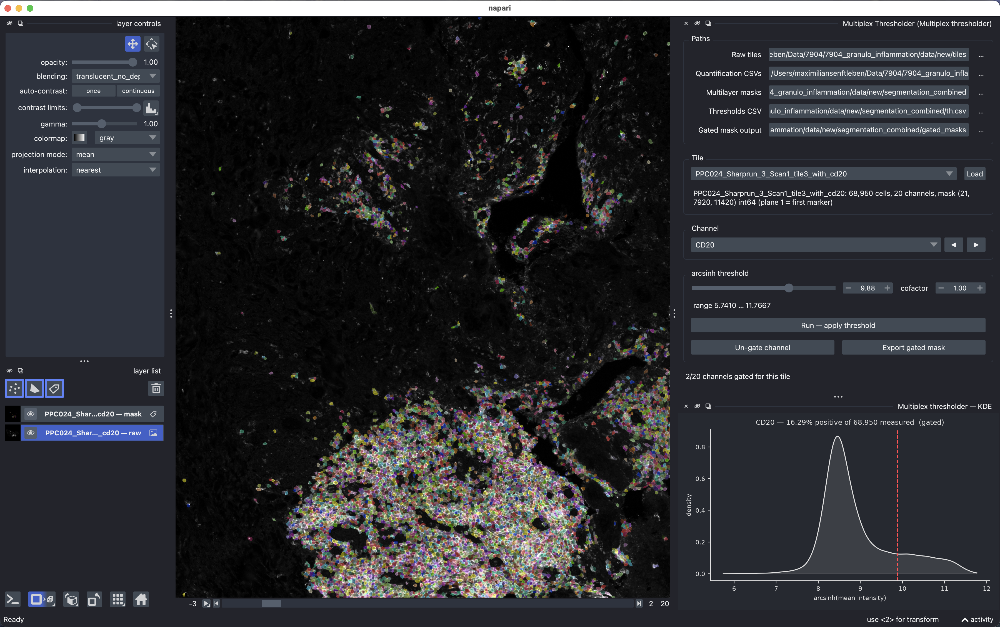

# napari-multiplex-thresholder

Desktop installable napari application with thresholding widget, where multiplexed data (for example whole slide imaging spatial proteomics data) can be manually gated.



## Manual

Set one intensity threshold per marker, per tile, by eye: pick a tile, pick a channel,
drag the slider until only the cells you would call positive are left, press **Run**.
After pressing run, the threshold is saved as csv.

---

### 1. Download output dataset from pipeline 1

One zip per dataset, containing the output of pipeline 1. Unzip and keep the folder structure intact. Three of its folders are used here:

| folder | contents |
|---|---|
| `tiles/` | the raw tiles, `<tile>.tif` |
| `csv/` | the measurements, `<tile>_quant.csv` — one column per marker |
| `multilayer/` | the cell masks, `<tile>_entire_mask.tif` |

Save the thresholds csv in the same folder. The gated multilayer mask can also be saved, but it is not necessary as they are saved in pipeline 2. 

### 2. Install and open

Unzip the application and double-click.

| | |
|---|---|
| **macOS** | Double-click and open. See Release info. |
| **Windows** | Keep the unzipped folder together, double-click `Multiplex Thresholder.exe`, then **More info ▸ Run anyway**. |
| **Linux** | Unpack and run `./"Multiplex Thresholder"/"Multiplex Thresholder"`. |

### 3. Set the paths

Fill in the **Paths** box at the top, using the `…` button or by typing and pressing
Enter. 

| field | point it at |
|---|---|
| Raw tiles | `tiles/` |
| Quantification CSVs | `csv/` |
| Multilayer masks | `multilayer/` |
| Thresholds CSV | where your results go, e.g. `manual_thresholds_2026-08-19.csv` in the dataset folder. It does not have to exist yet; an existing file is **extended**. |
| Gated mask output | optional, only for **Export gated mask** (§6). |

The **Tile** dropdown then lists every tile that has all three files. If it stays empty,
one of the first three paths is wrong.

## 4. Gate a tile

1. **Tile** ▸ choose a tile ▸ **Load**. The image and its mask appear.
2. **Channel** ▸ choose a marker, or step with **◀ ▶**. The channel dropdown and the
   image's channel slider stay in step, so you always see the marker you are gating.
3. Drag the **threshold** slider. The plot below shows that channel's intensity
   distribution (arcsinh normalised) with your threshold as a red dashed line, and the percentage of cells
   above it. Type an exact value in the box beside the slider if you prefer.
   The slider's range is this channel's own min–max in this tile.
4. Press **Run — apply threshold**. Cells below the threshold disappear from the mask,
   and the value is written to the CSV.

The status line at the bottom always shows `n/20 channels gated for this tile` and warns
how many are still unset. 

## 5. What is saved

- **`manual_thresholds_*.csv`** — rows are markers, columns are tiles. This is the file
  to hand back; it is what the statistics step reads. Written on every Run, safely
  (an interrupted write cannot corrupt it).
- **`manual_thresholds_*.csv.meta.json`** — a small companion file recording the
  cofactor, the source folders and which marker/tile pairs are still unset. 

## 6. Optional: export a gated mask

With **Gated mask output** set, **Export gated mask** writes
`<tile>_gated_mask.tif` — the mask with only the cells that passed each channel's
threshold. Nothing downstream needs it; it is for QC and for other tools. Ungated
channels are written as empty planes, and the app warns before doing so.

## Install

Download the file for your system from the
[Releases page](https://github.com/BIIFSweden/napari-multiplex-thresholder/releases),
unzip it, and double-click.

| | |
|---|---|
| **macOS** | `…-macos-arm64.zip` for Apple Silicon, `…-macos-x86_64.zip` for Intel. Move `Multiplex Thresholder.app` to Applications, then **right-click ▸ Open** the first time. |
| **Windows** | `…-windows-x64.zip`. Unzip the whole folder and keep it together, double-click `Multiplex Thresholder.exe`, then **More info ▸ Run anyway**. |
| **Linux** | `…-linux-x64.tar.gz`. Unpack and run `./"Multiplex Thresholder"/"Multiplex Thresholder"`. Needs a desktop with OpenGL. |

## Development

```bash
git clone https://github.com/BIIFSweden/napari-multiplex-thresholder.git
cd napari-multiplex-thresholder

uv venv .venv --python 3.13                                  # or python -m venv .venv
uv pip install --python .venv/bin/python -e ".[app,test]"     # or pip install -r requirements-dev.txt
```

Run it from the source tree:

```bash
.venv/bin/python -m napari_multiplex_thresholder      # the app: viewer + both docks
.venv/bin/multiplex-thresholder --self-test           # build the GUI headless and check it
.venv/bin/napari                                      # plain napari, load it from the Plugins menu
```

Tests:

```bash
.venv/bin/python tests/test_core.py               # 8 checks, synthetic data, no display
.venv/bin/python tests/test_widget_real_data.py   # 17 checks against real tiles; skips if absent
```

Build the double-clickable app locally:

```bash
uv pip install --python .venv/bin/python -e ".[bundle]"
.venv/bin/pyinstaller app/MultiplexThresholder.spec --noconfirm
open "dist/Multiplex Thresholder.app"                 # or dist/Multiplex Thresholder/ on Windows/Linux
```

## Release

Rehearse first, then tag where Both use the same build.

**1. Try it.** Actions ▸ **Build desktop apps** ▸ Run workflow on `main`, platforms
`all`. When it finishes, download the archives from the run's **Artifacts** and open the
app. No release is created by a dispatched run.

**2. Publish.** Make the version and the tag agree, then push the tag:

```bash
# `version` in pyproject.toml must equal the tag without its "v"
git commit -am "release v0.1.1"
git push
git tag v0.1.1
git push origin v0.1.1
```
